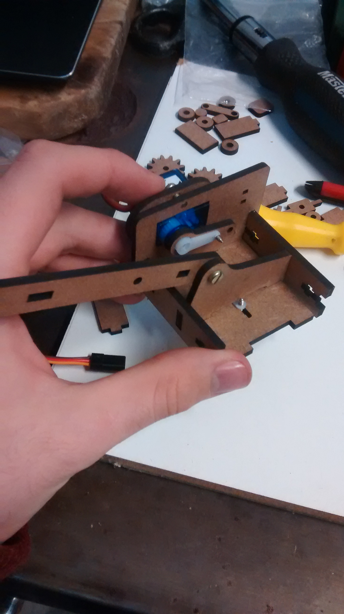
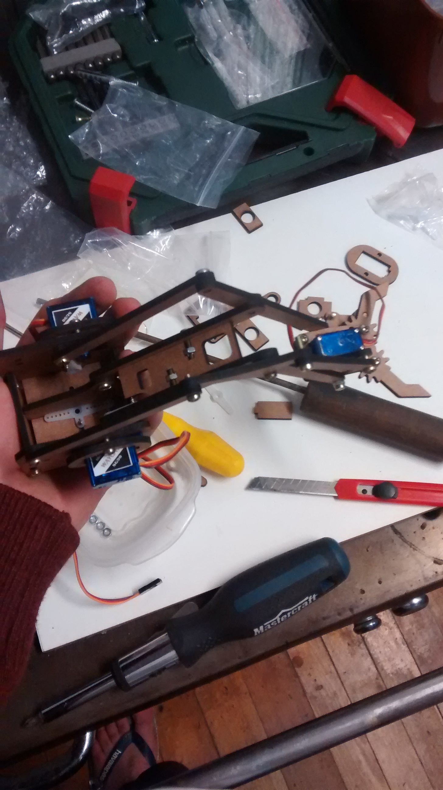

# Braço Robótico com Arduino

Projeto realizado para a Mostra Técnico-Científica 2019 (MTC 2019), sediada no Campus Bento Gonçalves do Instituto Federal de Educação, Ciência e Tecnologia do Rio Grande do Sul. A apresentação deste Trabalho se dará na mesma.

A montagem deste Braço Robótico tem como finalidade, demonstrar as possibilidades de aprendizado a partir da utilização de das Tecnologias da Informação e Comunicação (TIC) na máteria de Física, com fins didáticos utilizando de novas abordagens no ensino, como por exemplo a utilização da tecnologia para  desenvolvimento de conceitos com os alunos.

## Esquemático

Abaixo segue a figura que ilustra as conexões e componentes utilizados.

## Montagem

Abaixo se encontram as imagens da montagem do projeto.

  
  
  
  
  
  
  
  
  
  
  
  
  
  
  
  
  
  
  
  
  
  
  
  
  
  
  
  
  
  
  
  
  
  
  
  
  
  
  
  
  
  
  
  
  
